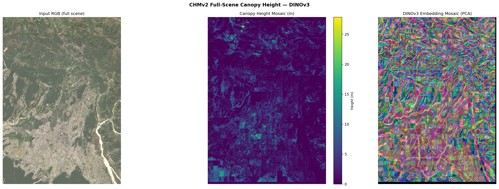

# openCHM: Cloud-Native Canopy Height Mapping


**openCHM** is an automated, end-to-end canopy height inference and field-plot validation pipeline built on Meta's **CHMv2 (DINOv3-ViT + DPT Head)** model. It runs on globally available ESRI World Imagery, is optimised for Apple Silicon (MPS), and includes a full validation workflow against field-measured tree heights.

---

## Pipeline Flowchart

```
┌─────────────────────────────────────────────────────────────────────┐
│                        openCHM Pipeline                             │
└─────────────────────────────────────────────────────────────────────┘

  INPUT
  ─────
  field_plots.geojson          config.yaml
  (sr, lat, lon, h_avg)        (model, tiling, output settings)
        │
        ▼
  ┌─────────────────────────────────────────────────────────────────┐
  │  STEP 1 — FETCH  (scripts/fetch_all_plots.py)                   │
  │                                                                 │
  │  • Compute tile (x, y) for each plot at zoom 18                 │
  │  • Deduplicate: plots sharing a tile → ONE 512×512 PNG          │
  │  • Fetch 2×2 ESRI tiles, stitch → esri_512_z18_{x}_{y}.png     │
  │  • Skip tiles already on disk (idempotent re-runs)              │
  │  • Write manifest: sr → {tile_key, tile_png, lat, lon, h_avg}   │
  └─────────────────────┬───────────────────────────────────────────┘
                        │
              data/input/esri_patches/
              esri_512_z18_*.png  (one per unique tile)
              data/input/plot_manifest.json
                        │
                        ▼
  ┌─────────────────────────────────────────────────────────────────┐
  │  STEP 2 — VALIDATE  (run_inference.py --mode validate)          │
  │                                                                 │
  │  ┌──────────────────────────────────────────────────────────┐   │
  │  │  2a. INFERENCE                                           │   │
  │  │  • Load CHMv2 model ONCE (DINOv3-ViT-L + DPT head)      │   │
  │  │  • For each unique tile PNG (progress bar):              │   │
  │  │    ─ Run batched inference → height map (H×W float32)    │   │
  │  │    ─ Save esri_512_z18_{x}_{y}_CHM.tif  (EPSG:3857)     │   │
  │  │    ─ Save esri_512_z18_{x}_{y}_EMB.png  (PCA embedding) │   │
  │  │  • Skip tiles whose CHM already exists (--overwrite off) │   │
  │  └──────────────────────────────────────────────────────────┘   │
  │                         │                                        │
  │                         ▼                                        │
  │  ┌──────────────────────────────────────────────────────────┐   │
  │  │  2b. COMPARE HEIGHTS                                     │   │
  │  │  • For each field plot (sr):                             │   │
  │  │    ─ Resolve CHM via manifest tile_key                   │   │
  │  │    ─ Clip CHM to 12.5×12.5 m square footprint           │   │
  │  │    ─ Filter pixels: nodata, coverage < threshold         │   │
  │  │    ─ Compute mean height within footprint                │   │
  │  │    ─ Status: ok / low_coverage / missing_chm / no_crs   │   │
  │  │  • Metrics: RMSE, MAE, bias, Pearson r, R²              │   │
  │  │  • vs benchmark: PolInSAR TSI (Khati 2014)              │   │
  │  │    RMSE = 2.28 m, r = 0.62                              │   │
  │  │  • Output: validation_results.csv                        │   │
  │  │            validation_metrics.json                       │   │
  │  │            validation_scatter.png                        │   │
  │  └──────────────────────────────────────────────────────────┘   │
  │                         │                                        │
  │                         ▼                                        │
  │  ┌──────────────────────────────────────────────────────────┐   │
  │  │  2c. VISUALISE                                           │   │
  │  │  • For each tile with ≥1 ok plot → tile panel PNG:       │   │
  │  │    ─ Left:  ESRI patch with ALL plot bboxes overlaid     │   │
  │  │             (distinct colour + sr label per plot)        │   │
  │  │    ─ Mid:   CHM heatmap with same bboxes                 │   │
  │  │    ─ Right: per-plot stats table                         │   │
  │  │             (sr | H_field | H_pred | Δ | status)        │   │
  │  │  • Summary dashboard PNG (6-panel):                      │   │
  │  │    map · residuals · benchmark bars · scatter · distrib  │   │
  │  └──────────────────────────────────────────────────────────┘   │
  └─────────────────────────────────────────────────────────────────┘
                        │
  OUTPUT
  ──────
  data/output/
  ├── esri_results/
  │   ├── esri_512_z18_*_CHM.tif        ← georeferenced CHM per tile
  │   └── esri_512_z18_*_EMB.png        ← DINOv3 embedding PCA
  ├── validation_results.csv            ← per-plot metrics
  ├── validation_metrics.json           ← RMSE / r / n vs benchmark
  ├── validation_scatter.png            ← scatter + benchmark bars
  ├── validation_summary_dashboard.png  ← 6-panel overview
  └── validation_panels/
      └── tile_z18_*_panel.png          ← one panel per tile (multi-bbox)
```

---

## Visuals

### Full-Scene Inference (STAC mode)

Left: Sentinel-2 RGB input. Center: CHM in metres. Right: DINOv3 PCA embedding.

### ESRI Patch Examples


---

## HuggingFace Access

The CHMv2 weights require a HuggingFace account with model access.

1. Open [facebook/dinov3-vitl16-chmv2-dpt-head](https://huggingface.co/facebook/dinov3-vitl16-chmv2-dpt-head) and request access.
2. Create a token at [huggingface.co/settings/tokens](https://huggingface.co/settings/tokens) (Read scope).

```bash
pip install -U "huggingface_hub[cli]"
hf auth login              # interactive
# or: hf auth login --token "$HF_TOKEN"
hf auth whoami             # verify
```

---

## Installation

```bash
git clone https://github.com/yourusername/openCHM.git
cd openCHM

micromamba env create -f environment.yml   # or: conda env create
micromamba activate chmv2

# Verify Apple Silicon GPU
python -c "import torch; print(torch.backends.mps.is_available())"

hf auth login   # required once
```

---

## Usage

### Mode 1 — STAC (full-scene Sentinel-2 GeoTIFF)

```bash
python run_inference.py --mode stac
```

Outputs to `data/output/`: `canopy_height_mosaic.tif`, `mosaic_visualisation.png`, per-patch PNGs.

---

### Mode 2 — ESRI (ad-hoc patch)

Fetch a single 512×512 patch and run inference:

```bash
# Fetch one patch
python scripts/fetch_esri_patches.py \
  --lat 30.455 --lon 78.075 --zoom 18 \
  --out_dir data/input/esri_patches

# Or fetch a bounding box grid
python scripts/fetch_esri_patches.py \
  --bbox 78.05 30.44 78.09 30.47 --zoom 18 \
  --out_dir data/input/esri_patches

# Run inference
python run_inference.py --mode esri \
  --esri_dir data/input/esri_patches
```

Outputs to `data/output/esri_results/`: `*_CHM.tif`, `*_EMB.png`.

---

### Mode 3 — Validate (full end-to-end pipeline)

Runs inference, comparison, and visualisation in one command. The model loads once and processes all tiles — no redundant reloads.

#### Step 1: Fetch tiles

```bash
python scripts/fetch_all_plots.py \
  --plots_geojson data/input/field_plots.geojson \
  --zoom 18 \
  --out_dir data/input/esri_patches \
  --manifest data/input/plot_manifest.json
```

Dry-run first to see which plots share tiles:

```bash
python scripts/fetch_all_plots.py --dry_run
```

#### Step 2: Infer + Compare + Visualise

```bash
python run_inference.py --mode validate
```

With options:

```bash
# Re-run inference even if CHMs exist
python run_inference.py --mode validate --overwrite

# Adjust footprint or coverage threshold
python run_inference.py --mode validate \
  --plot_size_m 12.5 \
  --min_coverage_ratio 0.85 \
  --rotation_deg 0.0
```

#### Outputs

```
data/output/
├── esri_results/
│   ├── esri_512_z18_{x}_{y}_CHM.tif   ← one per unique tile
│   └── esri_512_z18_{x}_{y}_EMB.png
├── validation_results.csv             ← sr, h_avg, h_pred, delta, status
├── validation_metrics.json            ← RMSE, r, MAE, bias vs benchmark
├── validation_scatter.png             ← scatter + benchmark comparison
├── validation_summary_dashboard.png   ← 6-panel overview dashboard
└── validation_panels/
    └── tile_z18_{x}_{y}_panel.png     ← ESRI + CHM + stats (all plots on tile)
```

---

### Standalone validation scripts

These still work independently if you want to re-run just one stage:

```bash
# Re-compare heights only (with tile-based CHM lookup)
python scripts/compare_heights.py \
  --plots_geojson data/input/field_plots.geojson \
  --chm_dir data/output/esri_results \
  --manifest data/input/plot_manifest.json

# Re-render panels + dashboard from existing CSV
python scripts/visualize_plots.py \
  --csv data/output/validation_results.csv \
  --manifest data/input/plot_manifest.json \
  --chm_dir data/output/esri_results

# Single tile panel only
python scripts/visualize_plots.py \
  --csv data/output/validation_results.csv \
  --manifest data/input/plot_manifest.json \
  --chm_dir data/output/esri_results \
  --tile_key z18_187906_107749

# Dashboard only
python scripts/visualize_plots.py \
  --csv data/output/validation_results.csv \
  --manifest data/input/plot_manifest.json \
  --summary_only
```

---

## Project Structure

```
openCHM/
├── run_inference.py              ← master entry point (stac / esri / validate)
├── config.yaml                  ← model, tiling, output settings
├── environment.yml
│
├── pipeline/                    ← core inference library
│   ├── model.py                 ← CHMv2 + DINOv3 model loader
│   ├── tiling.py                ← patch extraction + mosaicking
│   ├── inference.py             ← batched CHMv2 forward pass
│   ├── visualise.py             ← GeoTIFF writer + PCA embedding vis
│   └── runner.py                ← StacInferencePipeline / EsriPatchInferencePipeline
│
├── scripts/                     ← validation + data utilities
│   ├── fetch_esri_patches.py    ← download individual ESRI tiles
│   ├── fetch_all_plots.py       ← tile-deduplicated fetch + manifest writer
│   ├── validation_common.py     ← shared data types, metrics, geometry helpers
│   ├── compare_heights.py       ← CHM vs field plots → CSV + metrics + scatter
│   ├── visualize_plots.py       ← tile panels (multi-bbox) + summary dashboard
│   ├── run_inference_all_plots.py   ← (legacy; superseded by --mode validate)
│   └── compare_heights.py
│
├── notebooks/
│   ├── viz.ipynb
│   └── viz_esri.ipynb
│
└── data/
    ├── input/
    │   ├── field_plots.geojson  ← field plot coordinates + h_avg
    │   ├── plot_manifest.json   ← sr → tile_key + tile_png mapping
    │   └── esri_patches/        ← esri_512_z18_{x}_{y}.png tiles
    └── output/
        ├── esri_results/        ← *_CHM.tif, *_EMB.png
        ├── validation_results.csv
        ├── validation_metrics.json
        ├── validation_scatter.png
        ├── validation_summary_dashboard.png
        └── validation_panels/   ← tile_{tile_key}_panel.png
```

---

## Validation Benchmark

Field plots: Barkot Range, Uttarakhand (n=100, Khati 2014 dataset).  
Footprint: 12.5 × 12.5 m square centered on GPS coordinate.  
Coverage filter: ≥97% valid pixels inside footprint.

| Metric | PolInSAR TSI (Khati 2014) | CHMv2 (this work) |
|--------|--------------------------|-------------------|
| RMSE   | 2.28 m                   | —                 |
| r      | 0.62                     | —                 |

---

## Known Limitations & Roadmap

- **Tile alignment**: the 2×2 tile stitch starts at the tile index of the plot centre — plots near a tile edge may be off-centre in the 512px canvas. Fix planned: center the stitch on the plot's pixel position within the tile.
- **GEDI calibration**: bias correction using nearby GEDI L2A shots is not yet implemented.
- **Cloud/shadow masking**: SCL-based pre-filtering not yet integrated.
- **Terrain correction**: steep Himalayan slopes foreshorten canopy — slope-based scaling factor is future work.

---

## References

- CHMv2: [Tollefson et al. arXiv:2603.06382](https://arxiv.org/abs/2603.06382)
- DINOv3: [arXiv:2508.10104](https://arxiv.org/abs/2508.10104)
- Model weights: [facebook/dinov3-vitl16-chmv2-dpt-head](https://huggingface.co/facebook/dinov3-vitl16-chmv2-dpt-head)
- Field benchmark: Khati et al. 2014 — PolInSAR Three-Stage Inversion, Barkot Range
- Imagery: [ESRI World Imagery](https://www.esri.com/en-us/maps/imagery) (zoom 18, ~0.6 m/px)
- DEM: [Copernicus GLO-30](https://planetarycomputer.microsoft.com/) via Microsoft Planetary Computer
