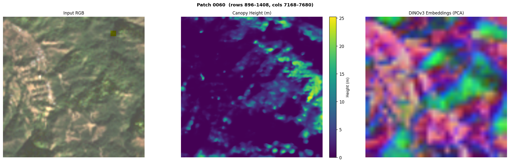
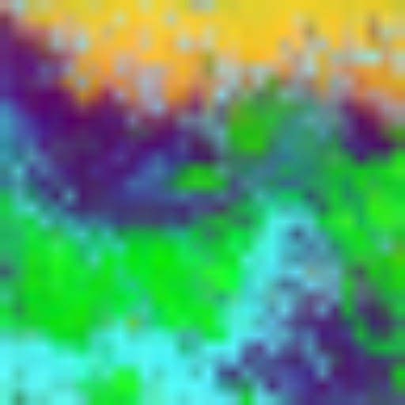

# 🌲 openCHM: Cloud-Native Canopy Height Mapping


**openCHM** is an automated, end-to-end inference pipeline that adapts Meta's high-resolution **CHMv2 (DINOv3 + DPT Head)** model to run on globally available Sentinel-2 RGB imagery.

Built as a practical geospatial inference engine, this pipeline handles fixed-range reflectance normalization, batched Vision Transformer (ViT) inference, and geospatial mosaicking, optimized for local Apple Silicon (M1/M2/M3) execution.

---

## 🚀 The Visuals

Create a `docs/images/` folder and place your exported figures there.

### 1. Full-Scene Inference

- **Left:** Upscaled, normalized Sentinel-2 RGB input.
- **Center:** Predicted Canopy Height Model (CHM) in meters.
- **Right:** DINOv3 backbone PCA embeddings (latent feature similarity map).

### 2. Micro-Structural Analysis (Patch Level)

- Patch-level (512x512) CHM output with corresponding local texture and structure patterns.

### 3. Latest ESRI Embedding (Generated)

- Latest generated ESRI-mode embedding output copied from `data/output/esri_results/`.

### 4. Optional Post-Processing Charts
- Add your downstream analytics chart at `docs/images/bar_chart.png` (for example, canopy density summaries by grid).

---

## ✨ Core Features

- **Smart physical normalization (`0-3000`)**
  Reflectance values are clipped to a stable physical range before conversion to uint8, reducing washed-out urban artifacts and preserving canopy texture contrast.

- **Bicubic upscaling with affine correction**
  Sentinel-2 inputs are upscaled (default `5x`) using cubic resampling, and the GeoTIFF affine transform is updated so outputs remain geospatially aligned.

- **Batched CHMv2 inference on Apple Metal (MPS)**
  Overlapping 512x512 patches are processed in configurable batches (`model.batch_size`) for better throughput on M-series GPUs.

- **Overlap-aware mosaicking**
  Patch predictions are merged with feathered blending (`linear`) to reduce edge seams.

- **Embedding visualization outputs**
  Generates full-scene PCA-based embedding maps in addition to canopy height outputs.

---

## 🔐 Hugging Face Access (Required)

Before first run:

1. Open model page: [facebook/dinov3-vitl16-chmv2-dpt-head](https://huggingface.co/facebook/dinov3-vitl16-chmv2-dpt-head)
2. Click **Request access** if your account is prompted for approval.
3. Create a token at [Hugging Face Tokens](https://huggingface.co/settings/tokens)
4. Use a token with at least **Read** scope.

Authenticate from terminal:

```bash
# inside active environment
pip install -U "huggingface_hub[cli]"

# interactive login
hf auth login

# OR token-based login
export HF_TOKEN="hf_xxx_your_token_here"
hf auth login --token "$HF_TOKEN"

# verify
hf auth whoami
```

Optional (persist token in shell):

```bash
echo 'export HF_TOKEN="hf_xxx_your_token_here"' >> ~/.zshrc
source ~/.zshrc
```

---

## 🛠️ Installation

```bash
# 1. Clone
git clone https://github.com/yourusername/openCHM.git
cd openCHM

# 2. Create environment (choose one)
micromamba env create -f environment.yml
# or: conda env create -f environment.yml

# 3. Activate
micromamba activate chmv2
# or: conda activate chmv2

# 4. Verify MPS availability (Apple Silicon)
python -c "import torch; print(torch.backends.mps.is_available())"

# 5. HF auth (required once)
hf auth login
```

---

## 💻 Usage

### Option 1: STAC mode (single GeoTIFF, full-scene mosaic)
Configure `config.yaml`:

```yaml
input:
  image_path: "data/input/sentinel2_rgb.tif"
  band_order: [1, 2, 3]
  upscale_factor: 5

model:
  hf_model_id: "facebook/dinov3-vitl16-chmv2-dpt-head"
  device: "mps"      # use "cpu" if needed
  batch_size: 4
```

Run:

```bash
python run_inference.py --config config.yaml --mode stac
```

Outputs are written to `data/output/`:
- `canopy_height_mosaic.tif`
- `mosaic_visualisation.png`
- `mosaic_canopy_height.png`
- `mosaic_embeddings_pca.png`
- `patches/patch_XXXX.png`

### Option 2: ESRI mode (directory of 512x512 PNG patches)
Fetch ESRI patches first:

```bash
# single center patch
python scripts/fetch_esri_patches.py --lat 30.455 --lon 78.075 --zoom 18 --out_dir data/input/esri_patches

# OR full area from bbox: min_lon min_lat max_lon max_lat
python scripts/fetch_esri_patches.py --bbox 78.05 30.44 78.09 30.47 --zoom 18 --out_dir data/input/esri_patches
```

Run ESRI inference:

```bash
python run_inference.py --config config.yaml --mode esri --esri_dir data/input/esri_patches
```

ESRI outputs are written to:
- `data/output/esri_results/*_CHM.tif`
- `data/output/esri_results/*_EMB.png`

### Visualize ESRI results in notebook

```bash
jupyter lab notebooks/viz_esri.ipynb
```

If you use classic notebook UI:

```bash
jupyter notebook notebooks/viz_esri.ipynb
```

---

## 📁 Project Structure

```text
openCHM/
├── run_inference.py
├── config.yaml
├── environment.yml
├── pipeline/
│   ├── model.py
│   ├── tiling.py
│   ├── inference.py
│   ├── visualise.py
│   └── runner.py
├── scripts/
│   ├── create_test_image.py
│   ├── fetch_esri_patches.py
│   └── fetch_test_image.py
├── notebooks/
│   ├── viz.ipynb
│   └── viz_esri.ipynb
└── data/
    ├── input/
    └── output/
```

---

## ⚠️ Known Limitations & Future Work

- **Interpolation ceiling:** Upscaling 10 m input improves model compatibility, but does not create new physical detail.
- **Terrain/shadow sensitivity:** Deep topographic shadows can still bias predictions in complex terrain.
- **Calibration roadmap:** Future versions can add GEDI-based calibration for tighter biome-specific scaling.
- **Cloud/shadow masking roadmap:** Scene Classification Layer (SCL) masking can be integrated as a pre-processing extension.

---

## 📚 Acknowledgements & References

- CHMv2 paper: [Tollefson et al. (arXiv:2603.06382)](https://arxiv.org/abs/2603.06382)
- DINOv3 paper: [arXiv:2508.10104](https://arxiv.org/abs/2508.10104)
- Foundation repo: [facebookresearch/dinov3](https://github.com/facebookresearch/dinov3)
- Model weights: [facebook/dinov3-vitl16-chmv2-dpt-head](https://huggingface.co/facebook/dinov3-vitl16-chmv2-dpt-head)
- Data source option: [Microsoft Planetary Computer](https://planetarycomputer.microsoft.com/)

Built as a spatial measurement engine for geospatial AI workflows.
