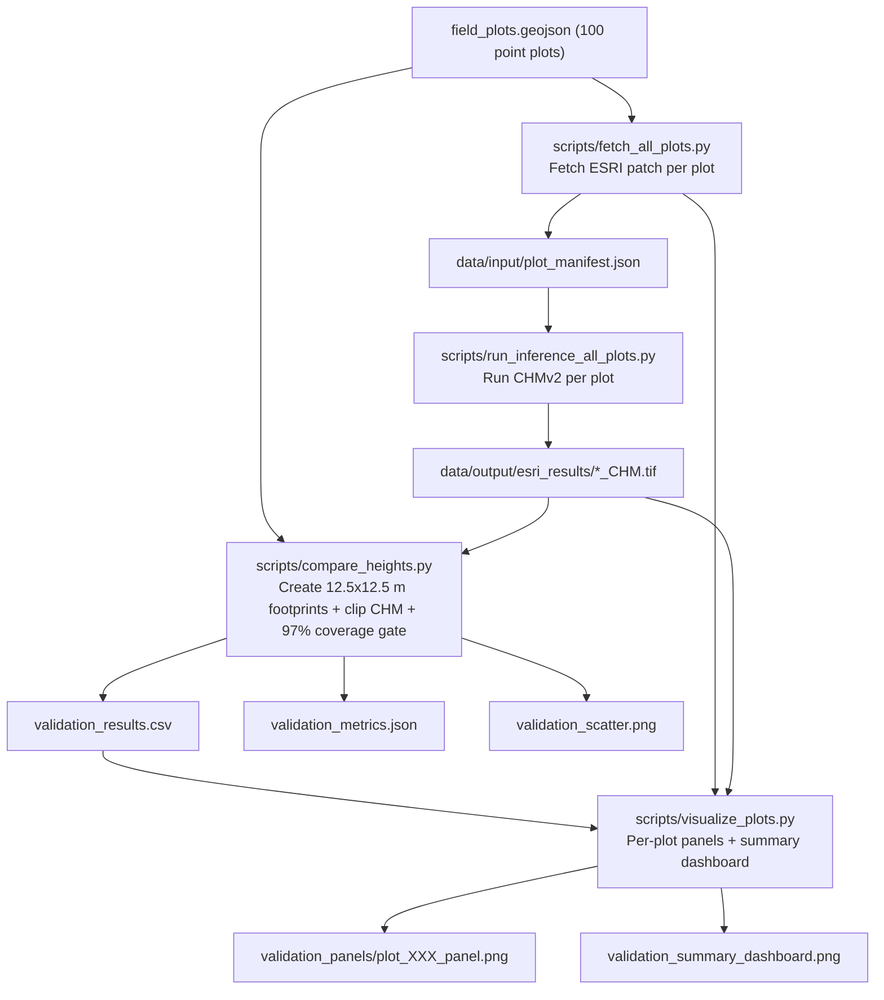

# CHMv2 Field Validation Pipeline

This document describes the end-to-end integration of the 100 Barkot field plots
(Khati 2014) into the CHMv2 inference repository.

## Goal

Use field-measured canopy height (`h_avg`) as the reference target (`y_true`) and compare
CHMv2 predictions (`y_pred`) against the published PolInSAR TSI baseline:

- PolInSAR TSI benchmark RMSE: **2.28 m**
- PolInSAR TSI benchmark Pearson r: **0.62**

## Reference Data

- Point vector: `data/input/field_plots.geojson`
- Each feature properties:
  - `sr` (plot id)
  - `h_avg` (field canopy height in meters)

## What the pipeline does

1. Fetches one ESRI 512x512 patch for each field plot.
2. Runs CHMv2 on each patch and writes georeferenced CHM GeoTIFF.
3. Builds 12.5 m × 12.5 m square polygons around each field point center.
4. Clips each square footprint against CHM, computes mean canopy height from included pixels.
5. Applies minimum coverage filter: **at least 97% valid pixels** in footprint.
5. Computes model metrics and benchmark deltas.
6. Produces per-plot panels and a final dashboard.

## Flowchart



## Commands

Run from repo root.

```bash
# 0) (optional) ensure env has required libs
# conda/micromamba env create -f environment.yml

# 1) fetch one patch per plot
python scripts/fetch_all_plots.py \
  --plots_geojson data/input/field_plots.geojson \
  --zoom 18

# 2) run CHMv2 inference per plot
python scripts/run_inference_all_plots.py \
  --config config.yaml \
  --manifest data/input/plot_manifest.json \
  --out_root data/output/esri_results

# 3) compute benchmark metrics using 12.5x12.5 m square clipping
python scripts/compare_heights.py \
  --plots_geojson data/input/field_plots.geojson \
  --chm_dir data/output/esri_results \
  --footprint_shape square \
  --plot_size_m 12.5 \
  --min_coverage_ratio 0.97 \
  --out_csv data/output/validation_results.csv \
  --out_metrics data/output/validation_metrics.json \
  --out_plot data/output/validation_scatter.png \
  --out_footprints_geojson data/output/field_plot_footprints.geojson

# 4) generate visual deliverables
python scripts/visualize_plots.py \
  --csv data/output/validation_results.csv \
  --patch_dir data/input/esri_patches \
  --chm_dir data/output/esri_results \
  --footprint_shape square \
  --plot_size_m 12.5 \
  --out_dir data/output/validation_panels \
  --dashboard data/output/validation_summary_dashboard.png
```

## Notes on spatial correctness

- Field footprints are 12.5x12.5 m geodesic squares in EPSG:4326.
- CHM outputs for ESRI mode are georeferenced from tile metadata in filename
  (`..._z<zoom>_<x>_<y>.png`) and written in EPSG:3857.
- Footprint clipping is done in raster CRS via `rasterio.warp.transform_geom`
  and `rasterio.mask.mask`, with per-plot pixel coverage QA.

## Key outputs

- `data/output/field_plot_footprints.geojson`
- `data/output/validation_results.csv`
- `data/output/validation_metrics.json`
- `data/output/validation_scatter.png`
- `data/output/validation_summary_dashboard.png`
- `data/output/validation_panels/plot_XXX_panel.png`

## Interpretation

- If `validation_metrics.json` reports `beats_rmse_benchmark=true`, CHMv2 outperforms
  the published PolInSAR RMSE baseline.
- If Pearson `r` approaches or exceeds `0.62`, optical CHMv2 is matching correlation
  behavior of the benchmark on this dataset.
